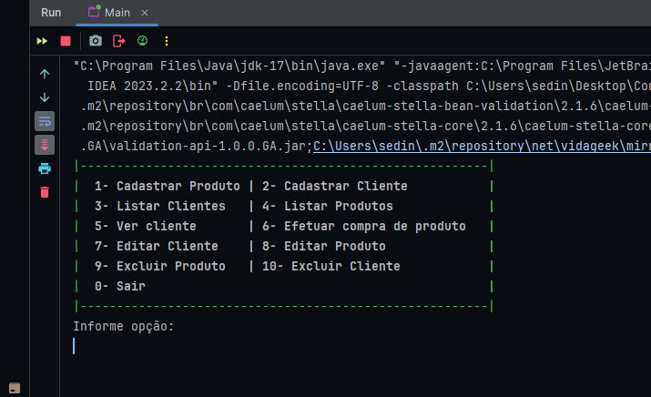

# Controle De Estoque

iniciar projeto:

> **git clone https://github.com/Edinaelson/ControleDeEstoque.git**

### Telas do Aplicativo

> ### Menu
> 

> Links de Estudo.
>
> cores terminal: 
>> https://www.alura.com.br/artigos/decorando-terminal-cores-emojis
>
> Validar CPF:
>> https://www.alura.com.br/artigos/validando-cpf-com-java-atraves-do-stella
> 
> Tratamento de Exceções:
>> https://www.alura.com.br/conteudo/java-excecoes